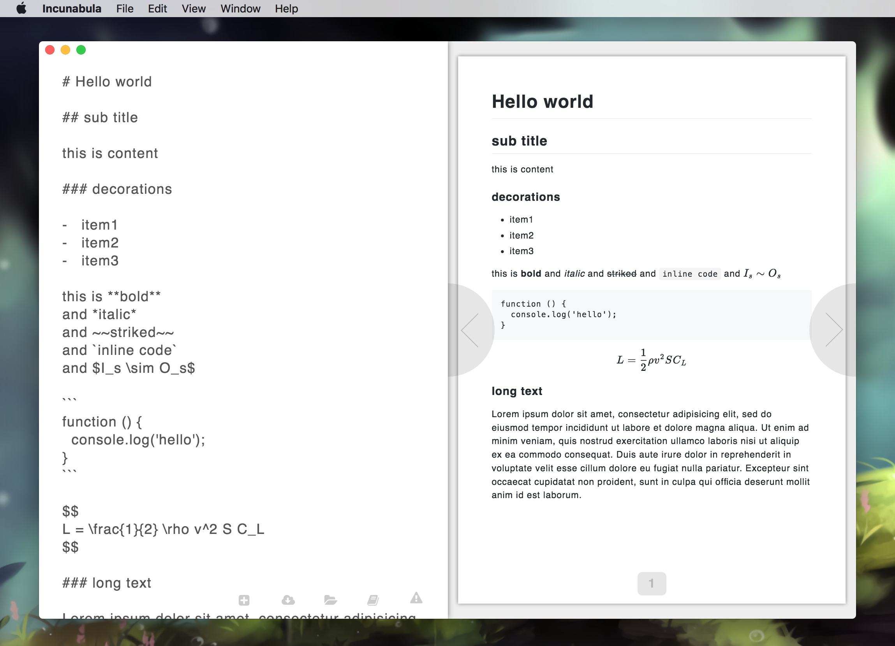

# Incunabula

[![js-standard-style][0]][1]

Tools for writing for printing. Currently supporting macos and linux.

## Features

- Markdown syntax
  - with math typesetting (KaTeX)
- Page break
- Realtime preview
- CSS stylesheet for printing

## In Progress

- [ ] ToC
- [ ] Caption number for figures
- [ ] Cover
- [ ] Content hierarchy for editor
- [ ] Custom syntax for markdown (based on `remark`)

## Developing

Start a local server at `localhost:9966`.

```
$ npm
$ npm start
```

## Packaging

Create an executable binary for macos and linux.

```
$ npm build
```

## Screenshot



## License

[MIT](https://tldrlegal.com/license/mit-license)

[0]: https://img.shields.io/badge/code%20style-standard-brightgreen.svg?style=flat-square
[1]: https://github.com/feross/standard
